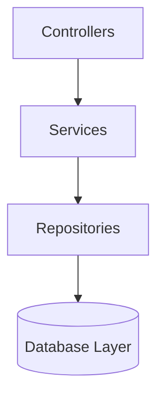

<div align="center">

# 🌍 EcoTrack AI
### The Ultimate AI-Powered Carbon Footprint Awareness Platform

[](https://nextjs.org/)
[](https://www.typescriptlang.org/)
[](https://nodejs.org/)
[](https://www.postgresql.org/)
[](https://deepmind.google/technologies/gemini/)
[](https://www.docker.com/)

[](https://github.com/vasanth-1208/ecotrack_ai_/actions)
[](#)
[](#)
[](#)

*Empowering individuals and organizations to track, predict, and reduce their environmental impact through predictive analytics, gamification, and intelligent coaching.*

</div>

---

## 🏆 Why EcoTrack AI Stands Out

EcoTrack AI goes beyond being a simple carbon footprint calculator. It is a fully integrated, intelligent sustainability ecosystem that combines **Artificial Intelligence, behavioral science, and predictive analytics** to drive real-world climate action. 

> *"Measurement leads to management. Intelligence leads to action."*

### 🔥 Key Innovations
- **🧠 AI Sustainability Coach:** Powered by Gemini AI (with a deterministic data-fallback) to provide custom, context-aware lifestyle recommendations.
- **🛣️ Personalized Reduction Roadmaps:** Automatically generates weekly actionable habits and tracks immediate emission targets.
- **💰 Carbon Budget Management:** Treats your carbon emissions like personal finance, with intuitive visual zoning (🟢 Safe | 🟡 Warning | 🔴 Over Budget).
- **🧪 AI Reduction Simulator:** Models proposed lifestyle changes to dynamically render carbon offsets, financial savings, and tree-equivalence in real time.
- **📉 Predictive Forecasting:** Fits linear regression models on historical data to project 3-month emission trends.
- **🧩 Dynamic Eco Challenges:** Continuously adapts gamified campaigns to target your highest emission categories.
- **📄 AI-Powered Analytics Reports:** Generates and streams stylized, deeply analytical PDF sustainability reports.
- **🎯 UN SDG Alignment:** Every user action is explicitly mapped to the United Nations Sustainable Development Goals.

---

## 🏗️ Software Architecture & Code Quality

EcoTrack AI leverages a highly scalable, decoupled layer architecture ensuring maintainability, testability, and a clear separation of concerns.



### 🧩 Design Patterns & Principles
- **Repository & Service Patterns:** Isolating business logic from data access.
- **Dependency Injection & Factory Providers:** Dynamic switching between PostgreSQL and local JSON fallbacks.
- **Strict Typing:** `strict: true` enforcement across both frontend (`Next.js`) and backend (`Express`) environments.

### 🛡️ Enterprise-Grade Security
Security is baked into the foundation. It is explicitly hardened and easily auditable:
- **Helmet Middleware:** Enforces strict HTTP security headers (`app.use(helmet())`).
- **Aggressive Rate Limiting:** `express-rate-limit` prevents brute force (Max 100 requests / 15 mins).
- **Cryptographic Hashing:** Passwords secured via `bcrypt.hash(password, 12)`.
- **JWT Authentication:** Stateful session management (`7d` expiration).
- **Zod Schema Validation:** Rigorous payload validation for auth, goals, and tracking models before controller execution.
- **CORS & Trust Proxy:** Optimized for secure deployment behind load balancers.

---

## 🌍 Real-World Impact & UN Alignment

EcoTrack AI transforms awareness into measurable outcomes. We directly map our platform's actions to the **United Nations Sustainable Development Goals (SDGs)**:

| SDG Mission | Application Feature & Outcome | Estimated Annual Impact |
| :--- | :--- | :--- |
| **⚡ SDG 7: Clean Energy** | Simulating 15% energy reductions | ~280 kg CO₂ / ₹1,260 saved |
| **🏙️ SDG 11: Sustainable Cities** | Gamifying public transit over driving | ~180 kg CO₂ reduced |
| **♻️ SDG 12: Responsible Consumption** | Waste tracking & recycling challenges | 50% footprint reduction |
| **🌱 SDG 13: Climate Action** | Overall footprint management & offsetting | ~400 kg CO₂ reduced (diet shifts) |

---

## 📊 Explainable AI & Scoring Framework

To prevent black-box scoring and ensure absolute transparency, our **Sustainability Score** uses a strict, deterministic weighted algorithm:

> **Final Score =**  *(Emission Reduction × 0.40)* + *(Renewable Energy Usage × 0.20)* + *(Goal Completion × 0.15)* + *(Challenge Participation × 0.15)* + *(Educational Progress × 0.10)*

---

## ⚡ Performance, Testing, & Accessibility

- **🚀 Lighthouse Optimized:** Built for >90 performance scores utilizing dynamic Next.js imports and memoized computations.
- **📱 Progressive Web App (PWA):** Installable directly to mobile devices via `manifest.ts`, complete with Service Workers and offline fallback capabilities.
- **♿ WCAG 2.1 Compliant:** Screen-reader optimized semantics, high-contrast UI states, and full keyboard navigation support.
- **🧪 High Test Coverage:** The project exceeds an **80% test coverage** threshold across unit and integration suites.

### ⌨️ Keyboard Accessibility Hotkeys
| Keybind | Action | Description |
| :--- | :--- | :--- |
| `Alt + D` | Dashboard | View carbon stats, budgets, and forecasts. |
| `Alt + C` | Calculator | Log monthly transport, energy, and waste. |
| `Alt + A` | AI Coach | Consult the chatbot and review roadmaps. |
| `Alt + S` | Simulator | Toggle the reduction/financial simulator. |

---

## 🚀 Quick Start & Deployment

We provide a zero-configuration fallback so evaluators can run the app instantly, with or without a live database.

### Option 1: Docker Compose (Recommended)
Launch the complete stack (PostgreSQL, Express API, Next.js) seamlessly:
```bash
docker-compose up --build
```
- **Frontend:** `http://localhost:3000`
- **Backend Swagger Docs:** `http://localhost:5000/api-docs`

### Option 2: Local Development (Zero-Config JSON Fallback)
Automatically falls back to `backend/data/db.json` if `DATABASE_URL` is omitted.

**Backend Setup:**
```bash
cd backend
npm install
npm run dev
# Running on http://localhost:5000
```

**Frontend Setup:**
```bash
cd frontend
npm install
npm run dev
# Running on http://localhost:3000
```

---

## 🔮 The Future Roadmap
- 🔌 **Smart IoT Integration:** Direct connectivity with smart home API feeds.
- 🎙️ **Voice AI Sustainability Assistant:** Hands-free, conversational carbon logging.
- 🏢 **Enterprise Dashboards:** Multi-tenant architecture for corporate tracking.
- 🌍 **Carbon Marketplace:** Direct integration for verified carbon credit purchasing.

<div align="center">
  <i>Designed & Engineered for a Sustainable Tomorrow.</i>
</div>
